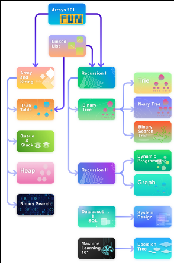
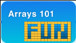
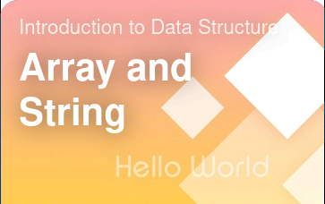

## About

My python exercises in https://leetcode.com/

## Explore learn

Cards from [Explore learn](https://leetcode.com/explore/learn/):

- [Arrays 101](#Arrays-101)
- [Array and String](#Array-and-String)
- [Linked list](#Linked-list)
- [Recursion I](#Recursion-I)
- [Recursion I](#Recursion-I)
- [Hash Table](#Hash-Table)

[Source of the dependency map](https://leetcode.com/explore/learn/card/the-leetcode-beginners-guide/679/sql-syntax/4358/)

### Arrays 101

[card/fun-with-arrays](https://leetcode.com/explore/learn/card/fun-with-arrays/)

#### Introduction

- [Max Consecutive Ones](https://leetcode.com/explore/learn/card/fun-with-arrays/521/introduction/3238/) - [problem](https://leetcode.com/problems/max-consecutive-ones) - [answer](problems/test_max_consecutive_ones.py)
- [Find Numbers with Even Number of Digits](https://leetcode.com/explore/learn/card/fun-with-arrays/521/introduction/3237/) - [problem](https://leetcode.com/problems/find-numbers-with-even-number-of-digits) - [answer](problems/test_find_numbers_with_even_number_of_digits.py)
- [Squares of a Sorted Array](https://leetcode.com/explore/learn/card/fun-with-arrays/521/introduction/3240/) - [problem](https://leetcode.com/problems/squares-of-a-sorted-array) - [answer](problems/test_squares_of_a_sorted_array.py)

#### Inserting items into an array

- [Duplicate Zeros](https://leetcode.com/explore/learn/card/fun-with-arrays/525/inserting-items-into-an-array/3245/) - [problem](https://leetcode.com/problems/duplicate-zeros) - [answer](problems/test_duplicate_zeros.py)
- [Merge Sorted Array](https://leetcode.com/explore/learn/card/fun-with-arrays/525/inserting-items-into-an-array/3253/) - [problem](https://leetcode.com/problems/merge-sorted-array) - [answer](problems/test_merge_sorted_array.py)

#### Deleting items from an array

- [Remove Element](https://leetcode.com/explore/learn/card/fun-with-arrays/526/deleting-items-from-an-array/3247/) - [problem](https://leetcode.com/problems/remove-element) - [answer](problems/test_remove_element.py)
- [Remove Duplicates from Sorted Array](https://leetcode.com/explore/learn/card/fun-with-arrays/526/deleting-items-from-an-array/3248/) - [problem](https://leetcode.com/problems/remove-duplicates-from-sorted-array) - [answer](problems/test_remove_duplicates_from_sorted_array.py)

#### Searching for items in an array

- [Check If N and Its Double Exist](https://leetcode.com/explore/learn/card/fun-with-arrays/527/searching-for-items-in-an-array/3250/) - [problem](https://leetcode.com/problems/check-if-n-and-its-double-exist) - [answer](problems/test_check_if_n_and_its_double_exist.py)
- [Valid Mountain Array](https://leetcode.com/explore/learn/card/fun-with-arrays/527/searching-for-items-in-an-array/3251/) - [problem](https://leetcode.com/problems/valid-mountain-array) - [answer](problems/test_valid_mountain_array.py)

#### In-place operations

- [Replace Elements with Greatest Element on Right Side](https://leetcode.com/explore/learn/card/fun-with-arrays/511/in-place-operations/3259/) - [problem](https://leetcode.com/problems/replace-elements-with-greatest-element-on-right-side) - [answer](problems/test_replace_elements_with_greatest_element_on_right_side.py)
- [Remove Duplicates from Sorted Array](https://leetcode.com/explore/learn/card/fun-with-arrays/511/in-place-operations/3258/) (duplicate) - [problem](https://leetcode.com/problems/remove-duplicates-from-sorted-array) - [answer](problems/test_remove_duplicates_from_sorted_array.py)
- [Move Zeroes](https://leetcode.com/explore/learn/card/fun-with-arrays/511/in-place-operations/3157/) - [problem](https://leetcode.com/problems/move-zeroes) - [answer](problems/test_move_zeroes.py)
- [Sort Array By Parity](https://leetcode.com/explore/learn/card/fun-with-arrays/511/in-place-operations/3260/) - [problem](https://leetcode.com/problems/sort-array-by-parity) - [answer](problems/test_sort_array_by_parity.py)
- [Remove Element](https://leetcode.com/explore/learn/card/fun-with-arrays/511/in-place-operations/3575/) (duplicate) - [problem](https://leetcode.com/problems/remove-element) - [answer](problems/test_remove_element.py)

#### Conclusion

- [Height Checker](https://leetcode.com/explore/learn/card/fun-with-arrays/523/conclusion/3228/) - [problem](https://leetcode.com/problems/height-checker) - [answer](problems/test_height_checker.py)
- [Third Maximum Number](https://leetcode.com/explore/learn/card/fun-with-arrays/523/conclusion/3231/) - [problem](https://leetcode.com/problems/third-maximum-number) - [answer](problems/test_third_maximum_number.py)
- [Find All Numbers Disappeared in an Array](https://leetcode.com/explore/learn/card/fun-with-arrays/523/conclusion/3270/) - [problem](https://leetcode.com/problems/find-all-numbers-disappeared-in-an-array) - [answer](problems/test_find_all_numbers_disappeared_in_an_array.py)
- [Squares of a Sorted Array](https://leetcode.com/explore/learn/card/fun-with-arrays/523/conclusion/3574/) (duplicate) - [problem](https://leetcode.com/problems/squares-of-a-sorted-array) - [answer](problems/test_squares_of_a_sorted_array.py)

### Array and String

[card/array-and-string](https://leetcode.com/explore/learn/card/array-and-string/)

#### Introduction to array

- [Find Pivot Index](https://leetcode.com/explore/learn/card/array-and-string/201/introduction-to-array/1144/) - [problem](https://leetcode.com/problems/find-pivot-index) - [answer](problems/test_find_pivot_index.py)
- [Largest Number At Least Twice of Others](https://leetcode.com/explore/learn/card/array-and-string/201/introduction-to-array/1147/) - [problem](https://leetcode.com/problems/largest-number-at-least-twice-of-others) - [answer](problems/test_largest_number_at_least_twice_of_others.py)
- [Plus One](https://leetcode.com/explore/learn/card/array-and-string/201/introduction-to-array/1148/) - [problem](https://leetcode.com/problems/plus-one) - [answer](problems/test_plus_one.py)

#### Introduction to 2D array

- [Diagonal Traverse](https://leetcode.com/explore/learn/card/array-and-string/202/introduction-to-2d-array/1167/) - [problem](https://leetcode.com/problems/diagonal-traverse) - [answer](problems/test_diagonal_traverse.py)
- [Spiral Matrix](https://leetcode.com/explore/learn/card/array-and-string/202/introduction-to-2d-array/1168/) - [problem](https://leetcode.com/problems/spiral-matrix) - [answer](problems/test_spiral_matrix.py)
- [Pascal's Triangle](https://leetcode.com/explore/learn/card/array-and-string/202/introduction-to-2d-array/1170/) - [problem](https://leetcode.com/problems/pascals-triangle) - [answer](problems/test_pascals_triangle.py)

#### Introduction to string

- [Add Binary](https://leetcode.com/explore/learn/card/array-and-string/203/introduction-to-string/1160/) - [problem](https://leetcode.com/problems/add-binary) - [answer](problems/test_add_binary.py)
- [Implement strStr()](https://leetcode.com/explore/learn/card/array-and-string/203/introduction-to-string/1161/) - [problem](https://leetcode.com/problems/find-the-index-of-the-first-occurrence-in-a-string) - [answer](problems/test_find_the_index_of_the_first_occurrence_in_a_string.py)
- [Longest Common Prefix](https://leetcode.com/explore/learn/card/array-and-string/203/introduction-to-string/1162/) - [problem](https://leetcode.com/problems/longest-common-prefix) - [answer](problems/test_longest_common_prefix.py)

#### Two pointer technique

- [Reverse String](https://leetcode.com/explore/learn/card/array-and-string/205/array-two-pointer-technique/1183/) - [problem](https://leetcode.com/problems/reverse-string) - [answer](problems/test_reverse_string.py)
- [Array Partition I](https://leetcode.com/explore/learn/card/array-and-string/205/array-two-pointer-technique/1154/) - [problem](https://leetcode.com/problems/array-partition) - [answer](problems/test_array_partition.py)
- [Two Sum II - Input array is sorted](https://leetcode.com/explore/learn/card/array-and-string/205/array-two-pointer-technique/1153/) - [problem](https://leetcode.com/problems/two-sum-ii-input-array-is-sorted) - [answer](problems/test_array_partition.py)
- [Remove Element](https://leetcode.com/explore/learn/card/array-and-string/205/array-two-pointer-technique/1151/) (duplicate) - [problem](https://leetcode.com/problems/remove-element) - [answer](problems/test_remove_element.py)
- [Max Consecutive Ones](https://leetcode.com/explore/learn/card/array-and-string/205/array-two-pointer-technique/1301/) (duplicate) - [problem](https://leetcode.com/problems/max-consecutive-ones) - [answer](problems/test_max_consecutive_ones.py)
- [Minimum Size Subarray Sum](https://leetcode.com/explore/learn/card/array-and-string/205/array-two-pointer-technique/1299/) - [problem](https://leetcode.com/problems/minimum-size-subarray-sum) - [answer](problems/test_minimum_size_subarray_sum.py)

#### Conclusion

- [Rotate Array](https://leetcode.com/explore/learn/card/array-and-string/204/conclusion/1182/) - [problem](https://leetcode.com/problems/rotate-array) - [answer](problems/test_minimum_size_subarray_sum.py)
- [Pascal's Triangle II](https://leetcode.com/explore/learn/card/array-and-string/204/conclusion/1171/) - [problem](https://leetcode.com/problems/pascals-triangle-ii) - [answer](problems/test_pascals_triangle_ii.py)
- [Reverse Words in a String](https://leetcode.com/explore/learn/card/array-and-string/204/conclusion/1164/) - [problem](https://leetcode.com/problems/reverse-words-in-a-string) - [answer](problems/test_reverse_words_in_a_string.py)
- [Reverse Words in a String III](https://leetcode.com/explore/learn/card/array-and-string/204/conclusion/1165/) - [problem](https://leetcode.com/problems/reverse-words-in-a-string-iii) - [answer](problems/test_reverse_words_in_a_string_iii.py)
- [Remove Duplicates from Sorted Array](https://leetcode.com/explore/learn/card/fun-with-arrays/511/in-place-operations/3258/) (duplicate) - [problem](https://leetcode.com/problems/remove-duplicates-from-sorted-array) - [answer](problems/test_remove_duplicates_from_sorted_array.py)
- [Move Zeroes](https://leetcode.com/explore/learn/card/fun-with-arrays/511/in-place-operations/3157/) (duplicate) - [problem](https://leetcode.com/problems/move-zeroes) - [answer](problems/test_move_zeroes.py)

### Linked list

[card/linked-list](https://leetcode.com/explore/learn/card/linked-list/)

#### Singly Linked List

- [Design Linked List](https://leetcode.com/explore/learn/card/linked-list/209/singly-linked-list/1290/) - [problem](https://leetcode.com/problems/design-linked-list) - [answer](problems/test_design_linked_list.py)

#### Two pointer technique

- [Linked List Cycle](https://leetcode.com/explore/learn/card/linked-list/214/two-pointer-technique/1212/) - [problem](https://leetcode.com/problems/linked-list-cycle) - [answer](problems/test_linked_list_cycle.py)
- [Linked List Cycle II](https://leetcode.com/explore/learn/card/linked-list/214/two-pointer-technique/1214/) - [problem](https://leetcode.com/problems/linked-list-cycle-ii) - [answer](problems/test_linked_list_cycle_ii.py)
- [Intersection of Two Linked Lists](https://leetcode.com/explore/learn/card/linked-list/214/two-pointer-technique/1215/) - [problem](https://leetcode.com/problems/intersection-of-two-linked-lists) - [answer](problems/test_intersection_of_two_linked_lists.py)
- [Remove Nth Node From End of List](https://leetcode.com/explore/learn/card/linked-list/214/two-pointer-technique/1296/) - [problem](https://leetcode.com/problems/remove-nth-node-from-end-of-list) - [answer](problems/test_remove_nth_node_from_end_of_list.py)

#### Classic problems

- [Reverse Linked List](https://leetcode.com/explore/learn/card/linked-list/219/classic-problems/1205/) - [problem](https://leetcode.com/problems/reverse-linked-list) - [answer](problems/test_reverse_linked_list.py)
- [Remove Linked List Elements](https://leetcode.com/explore/learn/card/linked-list/219/classic-problems/1207/) - [problem](https://leetcode.com/problems/remove-linked-list-elements) - [answer](problems/test_remove_linked_list_elements.py)
- [Odd Even Linked List](https://leetcode.com/explore/learn/card/linked-list/219/classic-problems/1208/) - [problem](https://leetcode.com/problems/odd-even-linked-list) - [answer](problems/test_odd_even_linked_list.py)
- [Palindrome Linked List](https://leetcode.com/explore/learn/card/linked-list/219/classic-problems/1209/) - [problem](https://leetcode.com/problems/palindrome-linked-list) - [answer](problems/test_palindrome_linked_list.py)
- [Design Linked List](https://leetcode.com/explore/learn/card/linked-list/210/doubly-linked-list/1294/) (duplicate) - [problem](https://leetcode.com/problems/design-linked-list) - [answer](problems/test_design_linked_list.py)

#### Conclusion

- [Merge Two Sorted Lists](https://leetcode.com/explore/learn/card/linked-list/213/conclusion/1227/) - [problem](https://leetcode.com/problems/merge-two-sorted-lists) - [answer](problems/test_merge_two_sorted_lists.py)
- [Add Two Numbers](https://leetcode.com/explore/learn/card/linked-list/213/conclusion/1228/) - [problem](https://leetcode.com/problems/add-two-numbers) - [answer](problems/test_add_two_numbers.py)
- [Flatten a Multilevel Doubly Linked List](https://leetcode.com/explore/learn/card/linked-list/213/conclusion/1225/) - [problem](https://leetcode.com/problems/flatten-a-multilevel-doubly-linked-list) - [answer](problems/test_flatten_a_multilevel_doubly_linked_list.py)
- [Copy List with Random Pointer](https://leetcode.com/explore/learn/card/linked-list/213/conclusion/1229/) -[problem](https://leetcode.com/problems/copy-list-with-random-pointer) - [answer](problems/test_copy_list_with_random_pointer.py)
- [Rotate List](https://leetcode.com/explore/learn/card/linked-list/213/conclusion/1295/) -[problem](https://leetcode.com/problems/rotate-list) - [answer](problems/test_rotate_list.py)

### Recursion I

[card/recursion-i](https://leetcode.com/explore/learn/card/recursion-i/)

#### Principle of recursion

- [Reverse String](https://leetcode.com/explore/featured/card/recursion-i/250/principle-of-recursion/1440/) (duplicate) - [problem](https://leetcode.com/problems/reverse-string) - [answer](problems/test_reverse_string.py)
- [Swap Nodes in Pairs](https://leetcode.com/explore/featured/card/recursion-i/250/principle-of-recursion/1681/) - [problem](https://leetcode.com/problems/swap-nodes-in-pairs) - [answer](problems/test_swap_nodes_in_pairs.py)

#### Recurrence relation

- [Reverse Linked List](https://leetcode.com/explore/featured/card/recursion-i/251/scenario-i-recurrence-relation/2378/) (duplicate) - [problem](https://leetcode.com/problems/reverse-linked-list) - [answer](problems/test_reverse_linked_list.py)
- [Pascal's Triangle II](https://leetcode.com/explore/featured/card/recursion-i/251/scenario-i-recurrence-relation/3234/) (duplicate) - [problem](https://leetcode.com/problems/pascals-triangle-ii) - [answer](problems/test_pascals_triangle_ii.py)

#### Memoization

- [Fibonacci Number](https://leetcode.com/explore/featured/card/recursion-i/255/recursion-memoization/1661/) - [problem](https://leetcode.com/problems/fibonacci-number) - [answer](problems/test_fibonacci_number.py)
- [Climbing Stairs](https://leetcode.com/explore/featured/card/recursion-i/255/recursion-memoization/1662/) - [problem](https://leetcode.com/problems/climbing-stairs) - [answer](problems/test_fibonacci_number.py)

#### Complexity analysis

- [Maximum Depth of Binary Tree](https://leetcode.com/explore/learn/card/recursion-i/256/complexity-analysis/2375/) - [problem](https://leetcode.com/problems/maximum-depth-of-binary-tree) - [answer](problems/test_maximum_depth_of_binary_tree.py)
- [Pow(x, n)](https://leetcode.com/explore/learn/card/recursion-i/256/complexity-analysis/2380/) - [problem](https://leetcode.com/problems/powx-n) - [answer](problems/test_powx_n.py)

#### Conclusion

- [Merge Two Sorted Lists](https://leetcode.com/explore/learn/card/recursion-i/253/conclusion/2382/) (duplicate) - [problem](https://leetcode.com/problems/merge-two-sorted-lists) - [answer](problems/test_merge_two_sorted_lists.py)
- [K-th Symbol in Grammar](https://leetcode.com/explore/learn/card/recursion-i/253/conclusion/1675/) - [problem](https://leetcode.com/problems/k-th-symbol-in-grammar) - [answer](problems/test_k_th_symbol_in_grammar.py)
- [Unique Binary Search Trees II] - [problem](https://leetcode.com/problems/unique-binary-search-trees-ii) - [answer](problems/test_unique_binary_search_trees_ii.py)

[Unique Binary Search Trees II]: https://leetcode.com/explore/learn/card/recursion-i/253/conclusion/2384/

#### Old

this exercise was in leetcode in 2023, but now there is [Unique Binary Search Trees II] instead

- [Search in a Binary Search Tree](https://leetcode.com/explore/learn/card/recursion-i/251/scenario-i-recurrence-relation/3233/) - [problem](https://leetcode.com/problems/search-in-a-binary-search-tree) - [answer](problems/test_search_in_a_binary_search_tree.py)

### Hash Table

[card/hash-table](https://leetcode.com/explore/learn/card/hash-table/)

#### Design a hash table

- [Design HashSet](https://leetcode.com/explore/learn/card/hash-table/182/practical-applications/1139/) - [problem](https://leetcode.com/problems/design-hashset) - [answer](problems/test_design_hashset.py)
- [Design HashMap](https://leetcode.com/explore/learn/card/hash-table/182/practical-applications/1140/) - [problem](https://leetcode.com/problems/design-hashmap) - [answer](problems/test_design_hashmap.py)

#### Practical application - hash set

- [Contains Duplicate](https://leetcode.com/explore/learn/card/hash-table/183/combination-with-other-algorithms/1112/) - [problem](https://leetcode.com/problems/contains-duplicate) - [answer](problems/test_contains_duplicate.py)
- [Single Number](https://leetcode.com/explore/learn/card/hash-table/183/combination-with-other-algorithms/1176/) - [problem](https://leetcode.com/problems/single-number) - [answer](problems/test_single_number.py)
- [Intersection of Two Arrays](https://leetcode.com/explore/learn/card/hash-table/183/combination-with-other-algorithms/1105/) - [problem](https://leetcode.com/problems/intersection-of-two-arrays) - [answer](problems/test_intersection_of_two_arrays.py)
- [Happy Number](https://leetcode.com/explore/learn/card/hash-table/183/combination-with-other-algorithms/1131/) - [problem](https://leetcode.com/problems/happy-number) - [answer](problems/test_happy_number.py)

#### Practical application - hash map

- [Two Sum](https://leetcode.com/explore/learn/card/hash-table/184/comparison-with-other-data-structures/1115/) - [problem](https://leetcode.com/problems/two-sum) - [answer](problems/test_two_sum.py)
- [Isomorphic Strings](https://leetcode.com/explore/learn/card/hash-table/184/comparison-with-other-data-structures/1117/) - [problem](https://leetcode.com/problems/isomorphic-strings) - [answer](problems/test_isomorphic_strings.py)
- [Minimum Index Sum of Two Lists](https://leetcode.com/explore/learn/card/hash-table/184/comparison-with-other-data-structures/1177/) - [problem](https://leetcode.com/problems/minimum-index-sum-of-two-lists) - [answer](problems/test_minimum_index_sum_of_two_lists.py)
- [First Unique Character in a String](https://leetcode.com/explore/learn/card/hash-table/184/comparison-with-other-data-structures/1120/) - [problem](https://leetcode.com/problems/first-unique-character-in-a-string) - [answer](problems/test_minimum_index_sum_of_two_lists.py)
- [Intersection of Two Arrays II](https://leetcode.com/explore/learn/card/hash-table/184/comparison-with-other-data-structures/1178/) - [problem](https://leetcode.com/problems/intersection-of-two-arrays-ii) - [answer](problems/test_intersection_of_two_arrays_ii.py)
- [Contains Duplicate II](https://leetcode.com/explore/learn/card/hash-table/184/comparison-with-other-data-structures/1121/) - [problem](https://leetcode.com/problems/contains-duplicate-ii) - [answer](problems/test_contains_duplicate_ii.py)
