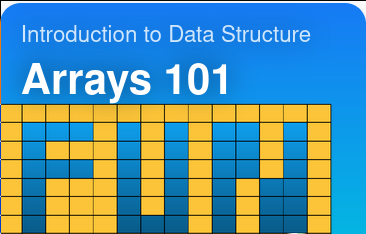

## About

My python exercises in https://leetcode.com/

## Explore learn

Cards from [Explore learn](https://leetcode.com/explore/learn/):

### Arrays 101

[card/fun-with-arrays](https://leetcode.com/explore/learn/card/fun-with-arrays/)

- [Introduction / Max Consecutive Ones](https://leetcode.com/explore/learn/card/fun-with-arrays/521/introduction/3238/) - [problem](https://leetcode.com/problems/max-consecutive-ones/description/) - [answer](problems/max_consecutive_ones/test_me.py)
